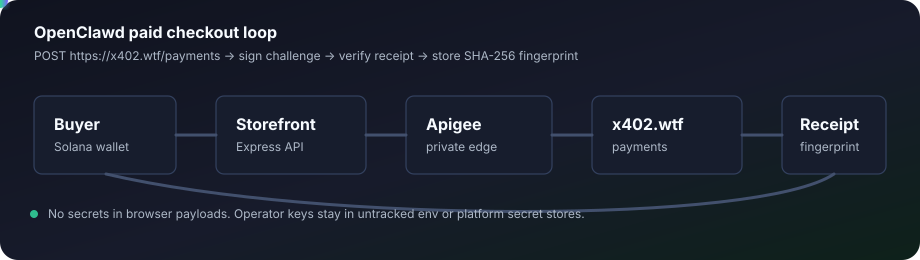

# Clawd Pay



> Clawd Pay is the private payments layer for the OpenClawd merchant runtime: a Solana-native, USDC-first checkout stack with real x402 challenges, private ingress, and durable receipt fingerprints.

## Pay surfaces

| Surface | Purpose |
| --- | --- |
| [https://x402.wtf/payments](https://x402.wtf/payments) | Primary x402 challenge endpoint |
| [https://x402.wtf/pay](https://x402.wtf/pay) | Short pay route for checkout flows |
| [https://pay.solanaclawd.com](https://pay.solanaclawd.com) | Branded pay host |
| [https://x402.wtf/agents/registry](https://x402.wtf/agents/registry) | Merchant registry |
| [https://github.com/Solizardking/solana-clawd/](https://github.com/Solizardking/solana-clawd/) | Companion agent runtime |

## What ships here

- Private payment routing behind an Apigee edge
- x402 challenge, signature, and receipt verification
- Merchant and agent registry material
- Truand keep-alive fleet provisioning
- Local storefront for checkout demos and operator review

## Private payments

Clawd Pay keeps payment material private by design.

- Wallet and provider secrets stay in untracked `.env.local` files or platform secret stores
- `payment-signature` and related headers are masked in debug paths
- `private.*` flow variables carry confidential payment and routing state
- Every verified order returns a durable receipt fingerprint for auditability
- The merchant stays registered at `https://x402.wtf/agents/registry`

## Payment flow

1. POST a product or checkout request to `https://x402.wtf/payments`.
2. If needed, use the shorter `https://x402.wtf/pay` route or the branded host `https://pay.solanaclawd.com`.
3. Sign the x402 challenge with a Solana wallet.
4. Replay the request with `payment-signature`.
5. Store the returned receipt fingerprint alongside the order record.

## Local workflow

```bash
npm install
npm --prefix storefront install
npm --prefix truand install
npm run list
npm run launch -- clawd ralph dexter eliza hermes x402wtf
npm run manifest
npm run truand:manifest
npm run apigee:integrate
npm run apigee:validate
npm run check
npm run storefront
```

## Repo map

- [merchant.md](./merchant.md) - agent-ready merchant announcement for `solana-clawd`
- [apigee/README.md](./apigee/README.md) - private edge bundle and policy notes
- [truand/README.md](./truand/README.md) - keep-alive fleet provisioning
- [storefront/public/index.html](./storefront/public/index.html) - local merchant UI
- [generated/openclawd.agent-store.json](./generated/openclawd.agent-store.json) - generated manifest snapshot

## Security posture

- `zerobro` is denied at admission
- Operator keys stay out of Git history
- `npm run check` is the pre-push validation gate
- Public links are documented here; secrets are not

## Brand note

Clawd Pay is the public label. OpenClawd remains the internal store/runtime name in manifests and generated artifacts.
